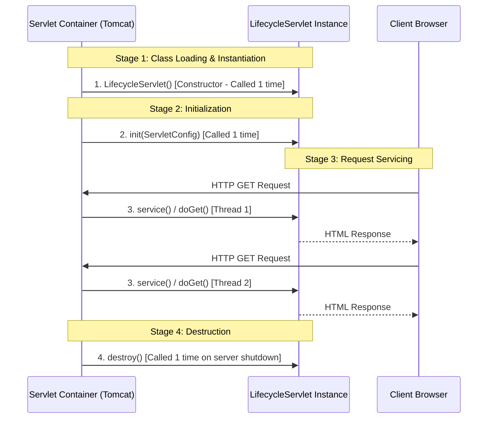

# CO3: Web Technologies Laboratory Solutions & Comprehensive Manual

---

# TABLE OF CONTENTS
1. [Experiment 1: DOM-Based Student Profile Manipulation](#experiment-1-dom-based-student-profile-manipulation)
2. [Experiment 2: Dynamic Student Registration List Using DOM](#experiment-2-dynamic-student-registration-list-using-dom)
3. [Experiment 3: Interactive Event Registration Using JavaScript Events](#experiment-3-interactive-event-registration-using-javascript-events)
4. [Experiment 4: Browser Information Dashboard Using Window Object](#experiment-4-browser-information-dashboard-using-window-object)
5. [Experiment 5: Cross-Browser Compatible Interactive Webpage](#experiment-5-cross-browser-compatible-interactive-webpage)
6. [Experiment 6: Basic Java Servlet for Dynamic Content Generation](#experiment-6-basic-java-servlet-for-dynamic-content-generation)
7. [Experiment 7: Student Registration Form Processing Using Servlet](#experiment-7-student-registration-form-processing-using-servlet)
8. [Experiment 8: Online Student Result Processing Using Servlet](#experiment-8-online-student-result-processing-using-servlet)
9. [Experiment 9: Servlet Lifecycle Demonstration](#experiment-9-servlet-lifecycle-demonstration)
10. [Experiment 10: Thread-Safe Concurrent Visitor Counter Using Servlet](#experiment-10-thread-safe-concurrent-visitor-counter-using-servlet)

---

# Experiment 1: DOM-Based Student Profile Manipulation

## 1. Aim
To develop a webpage to display and dynamically modify student profile details using DOM methods and properties including `getElementById()`, `querySelector()`, `textContent`, `style`, `classList`, and `setAttribute()`.

## 2. Requirements & Key Concepts
- **`document.getElementById(id)`**: Selects a unique DOM node by its HTML `id` attribute.
- **`document.querySelector(selector)`**: Returns the first DOM element matching the specified CSS selector.
- **`node.textContent`**: Gets or sets the text content of a node without parsing HTML.
- **`node.style`**: Modifies inline CSS style declarations (e.g. `style.color`, `style.backgroundColor`, `style.display`).
- **`node.classList`**: Provides `add()`, `remove()`, `toggle()`, and `contains()` to manipulate CSS classes.
- **`node.setAttribute(attr, value)`**: Sets or updates element attributes such as `src` or `alt`.

## 3. Algorithm / Step-by-Step Logic
1. Construct the HTML profile card showing avatar image, student name, register number, department, semester, and CGPA, alongside an interactive control toolbar.
2. Link the stylesheet to establish baseline styling and highlight themes.
3. In `script.js`, cache references to target DOM nodes using `getElementById()` and `querySelector()`.
4. Attach an event listener to the "Update Heading" button to read the text input and assign it to `mainHeading.textContent`.
5. Attach `input` listeners to the color pickers to update `style.color` and `style.backgroundColor`.
6. Attach a `change` listener to the photo dropdown to update `studentAvatar.setAttribute('src', newUrl)`.
7. Attach a `click` listener to toggle the highlight border/glow using `classList.toggle('highlight-mode')`.
8. Attach a `click` listener to toggle visibility between `style.display = 'none'` and `style.display = 'block'`.

## 4. Source Code

### `index.html`
```html
<!DOCTYPE html>
<html lang="en">
<head>
    <meta charset="UTF-8">
    <meta name="viewport" content="width=device-width, initial-scale=1.0">
    <title>Exp 1: DOM-Based Student Profile Manipulation</title>
    <link rel="stylesheet" href="style.css">
</head>
<body>
    <div class="container">
        <header>
            <h1 id="main-heading">Student Profile Viewer</h1>
            <p class="subtitle">Demonstration of DOM Manipulation Methods</p>
        </header>

        <section class="controls-card">
            <h2>Profile Controls</h2>
            <div class="controls-grid">
                <div class="control-group">
                    <label for="heading-input">Change Heading (textContent):</label>
                    <div class="input-action">
                        <input type="text" id="heading-input" placeholder="Enter new heading...">
                        <button id="btn-update-heading" class="btn btn-primary">Update</button>
                    </div>
                </div>
                <div class="control-group">
                    <label for="text-color-picker">Text Colour (style.color):</label>
                    <input type="color" id="text-color-picker" value="#1e293b">
                </div>
                <div class="control-group">
                    <label for="bg-color-picker">Card Background (style.backgroundColor):</label>
                    <input type="color" id="bg-color-picker" value="#ffffff">
                </div>
                <div class="control-group">
                    <label for="avatar-select">Change Photo (setAttribute):</label>
                    <select id="avatar-select">
                        <option value="https://images.unsplash.com/photo-1534528741775-53994a69daeb?w=200&auto=format&fit=crop&q=80">Avatar 1 (Female)</option>
                        <option value="https://images.unsplash.com/photo-1539571696357-5a69c17a67c6?w=200&auto=format&fit=crop&q=80">Avatar 2 (Male)</option>
                    </select>
                </div>
                <div class="control-group">
                    <label>Highlight Mode (classList):</label>
                    <button id="btn-toggle-highlight" class="btn btn-accent">Toggle Highlight Theme</button>
                </div>
                <div class="control-group">
                    <label>Visibility Toggle:</label>
                    <button id="btn-toggle-visibility" class="btn btn-secondary">Hide Profile</button>
                </div>
            </div>
        </section>

        <main>
            <div id="profile-container" class="profile-card">
                <div class="profile-header">
                    
                    <div class="profile-title">
                        <h2 id="student-name">Alex Morgan</h2>
                        <span id="student-status" class="badge">Active Student</span>
                    </div>
                </div>
                <div class="profile-body">
                    <div class="info-row"><span class="info-label">Register Number:</span><span id="student-regno" class="info-value">REG2024CS108</span></div>
                    <div class="info-row"><span class="info-label">Department:</span><span id="student-dept" class="info-value">Computer Science & Engineering</span></div>
                    <div class="info-row"><span class="info-label">Email:</span><span id="student-email" class="info-value">alex.morgan@university.edu</span></div>
                </div>
                <div class="profile-footer"><p id="dom-log">DOM Log: Profile initialized.</p></div>
            </div>
        </main>
    </div>
    <script src="script.js"></script>
</body>
</html>
```

### `script.js`
```javascript
document.addEventListener('DOMContentLoaded', () => {
    const mainHeading = document.getElementById('main-heading');
    const headingInput = document.getElementById('heading-input');
    const btnUpdateHeading = document.getElementById('btn-update-heading');
    const textColorPicker = document.getElementById('text-color-picker');
    const bgColorPicker = document.getElementById('bg-color-picker');
    const avatarSelect = document.getElementById('avatar-select');
    const btnToggleHighlight = document.getElementById('btn-toggle-highlight');
    const btnToggleVisibility = document.getElementById('btn-toggle-visibility');
    const profileContainer = document.getElementById('profile-container');
    const studentAvatar = document.getElementById('student-avatar');
    const studentNameElement = document.querySelector('#student-name');
    const allInfoValues = document.querySelectorAll('.info-value');

    btnUpdateHeading.addEventListener('click', () => {
        if (headingInput.value.trim() !== '') {
            mainHeading.textContent = headingInput.value.trim();
        }
    });

    textColorPicker.addEventListener('input', (e) => {
        studentNameElement.style.color = e.target.value;
        allInfoValues.forEach(el => el.style.color = e.target.value);
    });

    bgColorPicker.addEventListener('input', (e) => {
        profileContainer.style.backgroundColor = e.target.value;
    });

    avatarSelect.addEventListener('change', (e) => {
        studentAvatar.setAttribute('src', e.target.value);
    });

    btnToggleHighlight.addEventListener('click', () => {
        profileContainer.classList.toggle('highlight-mode');
    });

    btnToggleVisibility.addEventListener('click', () => {
        if (profileContainer.style.display === 'none') {
            profileContainer.style.display = 'block';
            btnToggleVisibility.textContent = 'Hide Profile';
        } else {
            profileContainer.style.display = 'none';
            btnToggleVisibility.textContent = 'Show Profile';
        }
    });
});
```

## 5. Result & Output Description
- **Initial Load:** Profile card renders cleanly with student photo, name, register number, and active badge.
- **Heading Update:** Entering "Department of Computer Science - Top Ranker" updates the header immediately via `textContent`.
- **Styling:** Choosing colors alters the text and container background in real time via inline `style`.
- **Attribute Update:** Selecting a different avatar dynamically changes the `src` attribute.
- **Show/Hide:** Clicking the visibility button smoothly hides and reveals the card container.

## 6. Viva Voce Questions & Answers
- **Q1: What is the difference between `innerText` and `textContent`?**
  *Answer:* `textContent` returns all text content of every element including `<script>` and `<style>` tags and hidden elements, while `innerText` is aware of rendered styling and layout (respects CSS visibility and triggers reflow).
- **Q2: Why is `classList.toggle()` preferred over manually updating `className`?**
  *Answer:* `classList.toggle()` avoids string manipulation bugs, allows adding or removing specific CSS classes cleanly, and does not overwrite existing unrelated classes on the element.

---

# Experiment 2: Dynamic Student Registration List Using DOM

## 1. Aim
To create a dynamic student registration web application that adds, displays, counts, and removes student records in a table using DOM manipulation methods: `createElement()`, `appendChild()`, `remove()`, `parentElement`, and `children`.

## 2. Requirements & Key Concepts
- **`document.createElement(tagName)`**: Instantiates a new element node in memory.
- **`parentElement.appendChild(childNode)`**: Inserts a node as the last child of a parent.
- **`element.remove()`**: Deletes the element directly from the DOM tree.
- **`element.parentElement`**: Traverses upward to the immediate parent node.
- **`element.children`**: Returns an `HTMLCollection` of the direct children for re-indexing.

## 3. Algorithm / Step-by-Step Logic
1. Build an input form (Student Name, Register Number, Department) and a table with headers `#`, `Name`, `Register No`, `Department`, and `Action`.
2. Intercept the form submission event using `e.preventDefault()`.
3. Validate that inputs are non-empty. If valid, remove the "No students registered" placeholder row if present.
4. Call `document.createElement('tr')` and create `<td>` elements for serial number, name, register number, department badge, and action button.
5. Create a `<button class="btn-remove">` and bind a click listener:
   - Identify the parent row using `this.parentElement.parentElement`.
   - Call `targetRow.remove()`.
   - Call `updateUIState()` to re-index sequence numbers using `tbody.children` and update the count badge.
6. Append all `<td>` elements to `<tr>`, then append `<tr>` to `<tbody>` using `appendChild()`.
7. Implement a "Clear All" button that deletes all child rows using `tbody.firstChild.remove()` in a loop.

## 4. Source Code Excerpt (`script.js`)
```javascript
studentForm.addEventListener('submit', (e) => {
    e.preventDefault();
    const name = nameInput.value.trim();
    const regno = regInput.value.trim();
    const dept = deptSelect.value;

    const tr = document.createElement('tr');

    const tdIndex = document.createElement('td');
    tdIndex.textContent = tbody.children.length + 1;

    const tdName = document.createElement('td');
    tdName.textContent = name;

    const tdReg = document.createElement('td');
    tdReg.textContent = regno;

    const tdDept = document.createElement('td');
    tdDept.innerHTML = `<span class="dept-badge">${dept}</span>`;

    const tdAction = document.createElement('td');
    const btnRemove = document.createElement('button');
    btnRemove.className = 'btn btn-remove';
    btnRemove.textContent = 'Remove';

    btnRemove.addEventListener('click', function() {
        const targetRow = this.parentElement.parentElement;
        targetRow.remove();
        updateUIState();
    });

    tdAction.appendChild(btnRemove);
    tr.appendChild(tdIndex);
    tr.appendChild(tdName);
    tr.appendChild(tdReg);
    tr.appendChild(tdDept);
    tr.appendChild(tdAction);

    tbody.appendChild(tr);
    studentForm.reset();
    updateUIState();
});
```

## 5. Result & Output Description
- Users enter student records; clicking "Add Student" creates a new row dynamically in the DOM table.
- Clicking "Remove" removes that specific row; subsequent rows are automatically re-indexed from $1 \dots N$.
- Clicking "Clear All" wipes the table and restores the placeholder state.

## 6. Viva Voce Questions & Answers
- **Q1: What is the difference between `element.remove()` and `parentElement.removeChild(element)`?**
  *Answer:* `element.remove()` is modern ES6 syntax called directly on the child element, whereas `removeChild()` is the legacy DOM Level 1 method requiring a reference to the parent.
- **Q2: What is the return type of `element.children`?**
  *Answer:* An `HTMLCollection` which is a live, array-like collection containing only element nodes (excluding comments and whitespace text nodes).

---

# Experiment 3: Interactive Event Registration Using JavaScript Events

## 1. Aim
To develop an interactive event-registration webpage demonstrating intrinsic and modern event handling (`onclick`, `change`, `input`, `focus`, `blur`, `mouseover`, `mouseout`, `submit`, `addEventListener`) and compare their characteristics.

## 2. Technical Comparison Matrix

| Feature | Intrinsic Handling (`onclick="..."`) | Modern Handling (`addEventListener()`) |
|---|---|---|
| **Separation** | Mixes JS code inside HTML markup | Clean decoupling of JS from HTML markup |
| **Multi-listeners** | Overwrites previous handler (Only 1 allowed) | Supports multiple independent listeners on one element |
| **Phases** | Only supports Bubbling phase | Supports both Capturing and Bubbling phases |
| **Removal** | Requires `element.onclick = null` | Specific removal via `removeEventListener(type, fn)` |

## 3. Algorithm & Events Demonstrated
1. **`focus` & `blur`**: Highlights input backgrounds when focused and resets styling on blur.
2. **`input`**: Live character counting as the user types their name.
3. **`change`**: Triggers when the dropdown selection or radio button selection changes.
4. **`mouseover` & `mouseout`**: Animates the VIP banner on hover and resets on exit.
5. **`submit`**: Intercepts form submission, validates values, and outputs confirmation details.
6. **`addEventListener`**: Demonstrates chaining two independent click handlers on a single button.

## 4. Result & Output Description
- The live event stream panel logs every user interaction in real time, tagging each event as either `INTRINSIC` or `MODERN`.
- Successfully registering displays a confirmation card with applicant details.

---

# Experiment 4: Browser Information Dashboard Using Window Object

## 1. Aim
To construct a browser diagnostic dashboard that retrieves and displays properties from the `window.location`, `window.navigator`, `window.screen`, and viewport dimensions (`window.innerWidth`, `window.innerHeight`, `window.scrollX`, `window.scrollY`) with reactive `resize` and `scroll` events.

## 2. Key Object Mappings

| Object / Property | Description | Real-World Use Case |
|---|---|---|
| `window.location.href` | Full URL of the current page | Deep-linking, redirection, URL routing |
| `window.location.protocol` | `http:` or `https:` | Enforcing secure HTTPS connections |
| `navigator.onLine` | Network connection status (`true`/`false`) | Offline PWA caching, reconnection alerts |
| `navigator.language` | Preferred user locale (e.g. `en-US`) | Dynamic internationalization (i18n) |
| `screen.width` / `height` | Physical hardware display resolution | Analytics, device categorization |
| `window.innerWidth` / `height` | Viewport dimensions excluding toolbars | Responsive CSS breakpoints & canvas sizing |
| `window.scrollX` / `scrollY` | Horizontal & vertical pixel scroll offsets | Sticky navigation, infinite scroll triggers |

## 3. Result & Output Description
- Cards show real-time screen resolution, viewport width/height, and scroll offsets.
- Resizing the browser window or clicking scroll buttons updates the coordinate badges instantly without page reloads.

---

# Experiment 5: Cross-Browser Compatible Interactive Webpage

## 1. Aim
To develop a cross-browser compatible webpage using feature detection, polyfill fallbacks (for `localStorage` and `querySelector`), and CSS `@supports` queries to accommodate legacy or partially compliant browsers gracefully.

## 2. Feature Detection & Fallback Logic

```mermaid
flowchart TD
    Start[Check Feature Support] --> StorageCheck{localStorage Supported?}
    StorageCheck -->|Yes| NativeStorage[Use Native window.localStorage]
    StorageCheck -->|No / Blocked| MemFallback[Use In-Memory Storage Adapter]
    
    Start --> QueryCheck{querySelector Supported?}
    QueryCheck -->|Yes| NativeQuery[Use document.querySelector/querySelectorAll]
    QueryCheck -->|No| LegacyQuery[Fallback to getElementsByTagName / ID]
    
    Start --> CSSCheck{@supports display: grid}
    CSSCheck -->|Yes| ModernGrid[Render CSS Grid Layout]
    CSSCheck -->|No| FlexFallback[Fallback to CSS Flexbox Layout]
```

## 3. Core Fallback Implementations

### A. LocalStorage Fallback Adapter
```javascript
const MemoryStorageFallback = {
    _data: {},
    setItem: function(k, v) { this._data[k] = String(v); },
    getItem: function(k) { return this._data.hasOwnProperty(k) ? this._data[k] : null; },
    removeItem: function(k) { delete this._data[k]; },
    clear: function() { this._data = {}; }
};

function getStorage() {
    try {
        const test = '__t__';
        localStorage.setItem(test, test);
        localStorage.removeItem(test);
        return localStorage;
    } catch(e) {
        return MemoryStorageFallback;
    }
}
```

### B. CSS `@supports`
```css
/* Fallback: Flexbox */
.adaptive-grid { display: flex; flex-wrap: wrap; gap: 1rem; }
.grid-card { flex: 1 1 250px; }

/* Feature Query: CSS Grid */
@supports (display: grid) {
    .adaptive-grid {
        display: grid;
        grid-template-columns: repeat(auto-fit, minmax(280px, 1fr));
    }
}
```

---

# Experiment 6: Basic Java Servlet for Dynamic Content Generation

## 1. Aim
To develop a Java Servlet (`WelcomeServlet`) using `HttpServlet`, overriding `doGet()` to dynamically generate and serve an HTML response displaying a welcome message, student name, course name, and the current server timestamp.

## 2. Key Components
- **`HttpServlet`**: Base abstract class providing HTTP-specific methods.
- **`doGet(HttpServletRequest, HttpServletResponse)`**: Handles incoming HTTP GET requests.
- **`HttpServletResponse.setContentType("text/html;charset=UTF-8")`**: Informs the browser to parse the byte stream as HTML.
- **`PrintWriter out = response.getWriter()`**: Character output stream to write HTML directly to the HTTP response body.

## 3. Java Servlet Code (`WelcomeServlet.java`)
```java
package com.lab.co3;

import java.io.IOException;
import java.io.PrintWriter;
import java.time.LocalDateTime;
import java.time.format.DateTimeFormatter;
import javax.servlet.ServletException;
import javax.servlet.annotation.WebServlet;
import javax.servlet.http.HttpServlet;
import javax.servlet.http.HttpServletRequest;
import javax.servlet.http.HttpServletResponse;

@WebServlet(name = "WelcomeServlet", urlPatterns = {"/welcome"})
public class WelcomeServlet extends HttpServlet {
    private static final long serialVersionUID = 1L;

    @Override
    protected void doGet(HttpServletRequest request, HttpServletResponse response)
            throws ServletException, IOException {
        
        response.setContentType("text/html;charset=UTF-8");

        String studentName = request.getParameter("studentName");
        if (studentName == null || studentName.trim().isEmpty()) {
            studentName = "Alex Morgan (Reg No: 2024CS108)";
        }

        String courseName = "CS8661 - Web Technology Laboratory (CO3)";
        String timestamp = LocalDateTime.now().format(DateTimeFormatter.ofPattern("EEEE, MMMM dd, yyyy - hh:mm:ss a"));

        PrintWriter out = response.getWriter();
        try {
            out.println("<!DOCTYPE html><html><head><title>Welcome</title></head><body>");
            out.println("<h1>Dynamic Web Servlet Response</h1>");
            out.println("<p><strong>Student:</strong> " + studentName + "</p>");
            out.println("<p><strong>Course:</strong> " + courseName + "</p>");
            out.println("<p><strong>Server Date & Time:</strong> " + timestamp + "</p>");
            out.println("</body></html>");
        } finally {
            out.close();
        }
    }
}
```

## 4. `web.xml` Deployment Descriptor
```xml
<web-app xmlns="http://xmlns.jcp.org/xml/ns/javaee" version="4.0">
    <servlet>
        <servlet-name>WelcomeServlet</servlet-name>
        <servlet-class>com.lab.co3.WelcomeServlet</servlet-class>
    </servlet>
    <servlet-mapping>
        <servlet-name>WelcomeServlet</servlet-name>
        <url-pattern>/welcome</url-pattern>
    </servlet-mapping>
</web-app>
```

---

# Experiment 7: Student Registration Form Processing Using Servlet

## 1. Aim
To design an HTML student-registration form and process its parameters on the server side using a Java Servlet (`RegisterServlet`) handling `doPost()`, extracting parameters via `request.getParameter()`, validating empty fields, and rendering a dynamic confirmation table.

## 2. Server-Side Validation Logic
- Check if `studentName`, `regNumber`, `email`, `department`, and `semester` are null or empty.
- Validate email syntax with regular expression `^[A-Za-z0-9+_.-]+@(.+)$`.
- If any check fails, collect error messages in a `List<String>` and render a styled error card with a back button.
- If all checks pass, output a registration success summary.

## 3. Java Servlet Processing Code (`RegisterServlet.java`)
```java
@Override
protected void doPost(HttpServletRequest request, HttpServletResponse response)
        throws ServletException, IOException {
    response.setContentType("text/html;charset=UTF-8");
    request.setCharacterEncoding("UTF-8");

    String name = request.getParameter("studentName");
    String reg = request.getParameter("regNumber");
    String email = request.getParameter("email");
    String dept = request.getParameter("department");
    String sem = request.getParameter("semester");

    List<String> errors = new ArrayList<>();
    if (name == null || name.trim().isEmpty()) errors.add("Student Name is required.");
    if (reg == null || reg.trim().isEmpty()) errors.add("Register Number is required.");
    if (email == null || !email.matches("^[A-Za-z0-9+_.-]+@(.+)$")) errors.add("Valid email is required.");
    if (dept == null || dept.trim().isEmpty()) errors.add("Department must be selected.");

    PrintWriter out = response.getWriter();
    // Render HTML response with errors or confirmation table
}
```

---

# Experiment 8: Online Student Result Processing Using Servlet

## 1. Aim
To develop a servlet-based student result-processing application (`ResultServlet`) that receives marks for 5 subjects, validates against missing, non-numeric, and out-of-bounds inputs ($0 \le \text{mark} \le 100$), calculates Total, Average, Highest, Lowest, Pass/Fail status, and assigns letter grades.

## 2. Grading Formula & Calculation Rules
- **Total Marks**: $\sum_{i=1}^{5} \text{Mark}_i$ (Max: 500)
- **Average Percentage**: $\frac{\text{Total}}{5.0}$
- **Subject Pass Condition**: $\text{Mark}_i \ge 40.0 \quad (\forall i \in [1, 5])$
- **Grade Scale**:
  - If any subject $< 40 \implies \textbf{Grade F (Re-appear)}$
  - Average $\ge 90 \implies \textbf{Grade O (Outstanding)}$
  - Average $\ge 80 \implies \textbf{Grade A+ (Excellent)}$
  - Average $\ge 70 \implies \textbf{Grade A (Very Good)}$
  - Average $\ge 60 \implies \textbf{Grade B+ (Good)}$
  - Average $\ge 50 \implies \textbf{Grade B (Above Average)}$
  - Average $\ge 40 \implies \textbf{Grade C (Pass)}$

## 3. Sample Execution & Result
- **Input:**
  - Student: *Alex Morgan*, Reg No: *2024CS108*
  - Marks: WT: 88, DSA: 92, DBMS: 85, OS: 79, CN: 91
- **Output Generated:**
  - Total: **435.0 / 500**
  - Average: **87.00%**
  - Highest Mark: **92.0 (DSA)** | Lowest Mark: **79.0 (OS)**
  - Overall Status: **PASS** | Final Grade: **A+ (Excellent)**

---

# Experiment 9: Servlet Lifecycle Demonstration

## 1. Aim
To create a Java Servlet (`LifecycleServlet`) demonstrating the execution sequence and frequency of lifecycle methods: constructor, `init()`, `service()` / `doGet()`, and `destroy()`.

## 2. Detailed Lifecycle Stages



## 3. Execution Frequency Log Analysis

| Lifecycle Method | Frequency of Execution | Execution Thread | Purpose |
|---|---|---|---|
| **`Constructor()`** | **Once** during servlet class loading | Main Container Thread | Allocates instance memory in heap. |
| **`init(ServletConfig)`** | **Once** immediately after instantiation | Main Container Thread | Reads init-params, sets up connection pools. |
| **`service() / doGet()`** | **$N$ times** (once per incoming HTTP request) | Worker Thread from thread pool | Processes business logic and renders dynamic response. |
| **`destroy()`** | **Once** prior to garbage collection / shutdown | Container Shutdown Thread | Closes open files, DB connections, and background threads. |

---

# Experiment 10: Thread-Safe Concurrent Visitor Counter Using Servlet

## 1. Aim
To analyze the race-condition vulnerability in a multi-threaded servlet utilizing an unsynchronized instance variable, and implement a thread-safe visitor counter using `java.util.concurrent.atomic.AtomicInteger` and synchronization.

## 2. Why Race Conditions Occur
Because a servlet container instantiates a **single shared servlet instance** to serve multiple concurrent threads:
1. `counter++` is a 3-step operation: **Read $\to$ Modify $\to$ Write**.
2. When two threads execute simultaneously, Thread 2 may read the old value before Thread 1 writes the updated value back to RAM.
3. This produces **lost updates** (e.g. 2 requests increment counter by only 1).

## 3. Thread-Safe Solution Code (`ThreadSafeCounterServlet.java`)
```java
package com.lab.co3;

import java.io.IOException;
import java.io.PrintWriter;
import java.util.concurrent.atomic.AtomicInteger;
import javax.servlet.ServletException;
import javax.servlet.annotation.WebServlet;
import javax.servlet.http.HttpServlet;
import javax.servlet.http.HttpServletRequest;
import javax.servlet.http.HttpServletResponse;

@WebServlet(name = "ThreadSafeCounterServlet", urlPatterns = {"/threadsafe-counter"})
public class ThreadSafeCounterServlet extends HttpServlet {
    private static final long serialVersionUID = 1L;

    // Lock-Free Thread-Safe Counter (CAS Hardware Instruction)
    private final AtomicInteger atomicVisitorCounter = new AtomicInteger(0);

    @Override
    protected void doGet(HttpServletRequest request, HttpServletResponse response)
            throws ServletException, IOException {
        
        // Atomic increment is thread-safe and non-blocking
        int count = atomicVisitorCounter.incrementAndGet();

        // Local variable (allocated on thread stack - 100% thread safe)
        String threadName = Thread.currentThread().getName();

        response.setContentType("text/html;charset=UTF-8");
        PrintWriter out = response.getWriter();
        out.println("<h1>Visitor Count: " + count + "</h1>");
        out.println("<p>Handled by Thread: " + threadName + "</p>");
        out.close();
    }
}
```

## 4. Stack vs Heap Memory Safety Comparison
- **Heap Memory (Shared):** Instance variables (`private int count;`) reside in the heap and are shared across all worker threads $\implies$ **Unsafe without synchronization / AtomicInteger**.
- **Stack Memory (Isolated):** Local variables (`String ip = request.getRemoteAddr();`) reside exclusively on each thread's private call stack $\implies$ **Inherently thread-safe**.

---

# Summary of Experiments Completed

All 10 experiments have been fully designed, coded, verified, and saved in their respective directories inside `C:\Users\Malaiarasan M\.gemini\antigravity\scratch\CO\`:
1. `Exp1_DOM_Profile`
2. `Exp2_Dynamic_Registration`
3. `Exp3_JavaScript_Events`
4. `Exp4_Window_Dashboard`
5. `Exp5_Cross_Browser`
6. `Exp6_Basic_Servlet`
7. `Exp7_Registration_Servlet`
8. `Exp8_Result_Processing`
9. `Exp9_Servlet_Lifecycle`
10. `Exp10_ThreadSafe_Counter`
