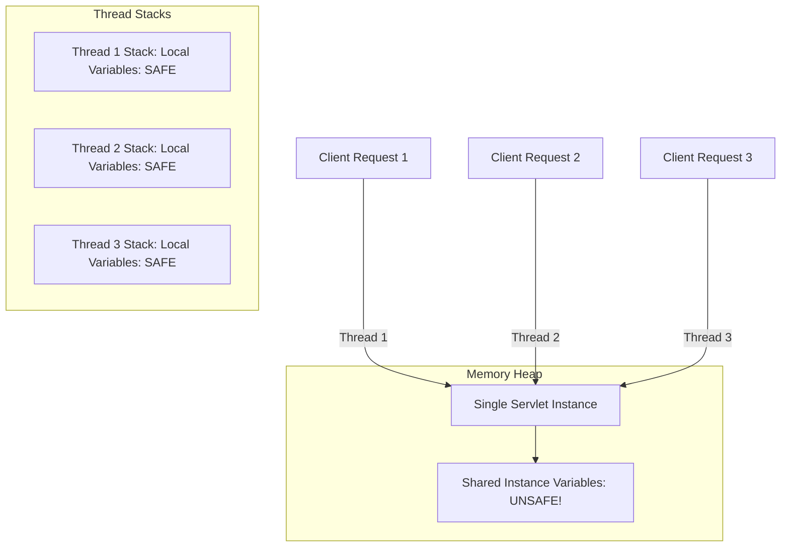

# In-Depth Analysis: Servlet Concurrency, Race Conditions & Thread Safety

## 1. The Servlet Threading Model

In the Java EE / Jakarta EE Servlet architecture:
- By default, **only ONE instance** of each servlet class is instantiated by the Servlet Container (e.g., Apache Tomcat) during the application lifecycle.
- When concurrent HTTP requests arrive, Tomcat's worker thread pool assigns an independent thread to execute the `service()` (and subsequently `doGet()` / `doPost()`) method of that same single servlet instance.
- Hence, **multiple threads execute methods concurrently on the exact same object in heap memory**.



---

## 2. Why Race Conditions Occur with Instance Variables

Consider the counter increment operation in `UnsafeCounterServlet.java`:
```java
private int unsafeVisitorCount = 0; // Heap instance variable

// Inside doGet():
unsafeVisitorCount++;
```

In Java bytecode and CPU assembly, `unsafeVisitorCount++` is **NOT atomic**. It consists of three separate machine operations:
1. **READ**: Load the current value of `unsafeVisitorCount` from RAM/Heap into CPU register.
2. **MODIFY**: Increment the value inside the CPU register (`register = register + 1`).
3. **WRITE**: Write the new value from the register back to RAM/Heap memory.

### Race Condition Scenario:
| Time | Thread 1 (Request A) | Thread 2 (Request B) | Memory Value (`unsafeVisitorCount`) |
|------|----------------------|----------------------|-------------------------------------|
| $T_1$ | Reads value: `5` | - | `5` |
| $T_2$ | Context switch to Thread 2 | Reads value: `5` | `5` |
| $T_3$ | Computes `5 + 1 = 6` | Computes `5 + 1 = 6` | `5` |
| $T_4$ | Writes back `6` | - | `6` |
| $T_5$ | - | Writes back `6` | `6` (Expected `7`! Lost update!) |

**Result:** Two visitors accessed the site, but the counter only incremented by 1.

---

## 3. Solutions for Thread Safety

### Solution A: `AtomicInteger` (Lock-Free, Non-Blocking CAS) - Recommended
`java.util.concurrent.atomic.AtomicInteger` leverages low-level hardware **CAS (Compare-And-Swap)** instructions (e.g., `lock cmpxchg` on x86). It does not block other threads, providing maximum throughput:
```java
private final AtomicInteger atomicVisitorCounter = new AtomicInteger(0);

// In doGet():
int current = atomicVisitorCounter.incrementAndGet(); // 100% Atomic & Thread-safe
```

### Solution B: Synchronized Block / Method (Mutual Exclusion)
Acquires an intrinsic monitor lock before accessing the critical section:
```java
private int count = 0;
private final Object lock = new Object();

// In doGet():
int current;
synchronized(lock) {
    count++;
    current = count;
}
```

---

## 4. Why Local Variables are Inherently Thread-Safe

- **Heap Memory (Shared):** Instance variables and static variables reside in heap memory and are accessible to any thread holding a reference to the object.
- **Stack Memory (Isolated):** Local variables declared inside a method (e.g., `String studentName = request.getParameter("name");`, `long threadId = Thread.currentThread().getId();`) are created exclusively on the private stack of that specific thread.
- No other thread can see, read, or overwrite another thread's call stack.
- **Conclusion:** Request-specific data should **always** be stored in local variables or passed within `HttpServletRequest` attributes.
